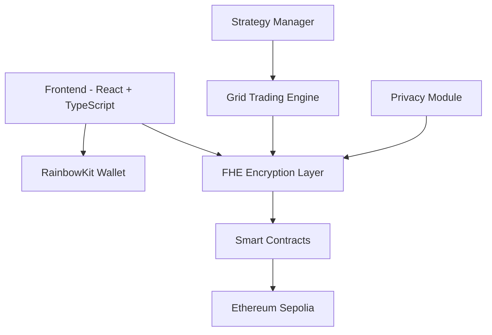

<div align="center">

# ⚡ Grid Cipher Trade

### 🔐 **Next-Generation FHE-Encrypted Trading Platform**

[](https://opensource.org/licenses/MIT)
[](https://www.typescriptlang.org/)
[](https://reactjs.org/)
[](https://vitejs.dev/)

*Revolutionary grid trading with complete privacy through Fully Homomorphic Encryption*

</div>

---

## 🌟 **What Makes Us Different?**

Grid Cipher Trade isn't just another trading platform—it's a **privacy-first revolution** in decentralized finance. While others expose your trading strategies and positions, we encrypt everything using cutting-edge FHE technology.

### 🛡️ **Zero-Knowledge Trading**
- **Complete Privacy**: Your trading data remains encrypted even during computation
- **Strategy Protection**: Grid strategies and positions are never exposed
- **Anonymous Execution**: Trade without revealing your identity or intentions

### ⚡ **Advanced Grid Intelligence**
- **Smart Grid Algorithms**: AI-powered grid spacing and level optimization
- **Multi-Asset Support**: Trade across multiple cryptocurrencies simultaneously
- **Real-time Execution**: Lightning-fast order execution with minimal slippage

---

## 🚀 **Quick Start**

### **Prerequisites**
```bash
Node.js >= 18.0.0
npm >= 8.0.0
```

### **Installation**
```bash
# Clone the repository
git clone https://github.com/melissa87jensen/grid-cipher-trade.git
cd grid-cipher-trade

# Install dependencies
npm install

# Start development server
npm run dev
```

### **Environment Setup**
Create a `.env.local` file with your configuration:
```env
VITE_CHAIN_ID=11155111
VITE_RPC_URL=your_rpc_endpoint
VITE_WALLET_CONNECT_PROJECT_ID=your_project_id
```

---

## 🏗️ **Architecture Overview**



---

## 🔧 **Tech Stack**

| Category | Technology | Purpose |
|----------|------------|---------|
| **Frontend** | React 18 + TypeScript | Modern UI framework |
| **Styling** | Tailwind CSS + shadcn/ui | Beautiful, responsive design |
| **Web3** | RainbowKit + Wagmi + Viem | Wallet integration |
| **Encryption** | FHE (Fully Homomorphic) | Privacy protection |
| **Blockchain** | Ethereum Sepolia | Testnet deployment |
| **Build Tool** | Vite | Fast development & build |

---

## 📊 **Features**

### 🔐 **Privacy Features**
- [x] **FHE-Encrypted Positions**: All trading positions encrypted
- [x] **Private Strategy Execution**: Grid strategies remain confidential
- [x] **Anonymous Trading**: No identity exposure
- [x] **Encrypted Profit/Loss**: Financial data protected

### ⚡ **Trading Features**
- [x] **Grid Trading**: Automated buy/sell grid strategies
- [x] **Multi-Level Grids**: Support for complex grid configurations
- [x] **Real-time Execution**: Instant order processing
- [x] **Portfolio Management**: Track encrypted positions

### 🛠️ **Developer Features**
- [x] **TypeScript**: Full type safety
- [x] **Modern React**: Hooks, Context, and modern patterns
- [x] **Component Library**: Reusable UI components
- [x] **Hot Reload**: Fast development experience

---

## 🎯 **Smart Contract Features**

Our FHE-enabled smart contracts provide:

```solidity
// Example: Encrypted position creation
function createPosition(
    externalEuint32 amount,
    externalEuint32 price,
    externalEuint32 gridLevel,
    bool isLong,
    bytes calldata inputProof
) public returns (uint256)
```

- **Encrypted Data Storage**: All sensitive data encrypted on-chain
- **Private Computation**: Calculations performed on encrypted data
- **Zero-Knowledge Proofs**: Verify transactions without revealing data
- **Gas Optimization**: Efficient FHE operations

---

## 🚀 **Deployment**

### **Vercel (Recommended)**
```bash
# Connect to Vercel
vercel --prod

# Configure environment variables in Vercel dashboard
# Deploy automatically on git push
```

### **Manual Build**
```bash
npm run build
# Deploy dist/ folder to your hosting provider
```

---

## 🤝 **Contributing**

We welcome contributions! Here's how to get started:

1. **Fork** the repository
2. **Create** a feature branch: `git checkout -b feature/amazing-feature`
3. **Commit** your changes: `git commit -m 'Add amazing feature'`
4. **Push** to the branch: `git push origin feature/amazing-feature`
5. **Open** a Pull Request

### **Development Guidelines**
- Follow TypeScript best practices
- Write meaningful commit messages
- Add tests for new features
- Update documentation

---

## 📈 **Roadmap**

### **Phase 1** ✅
- [x] Basic FHE integration
- [x] Wallet connection
- [x] Grid trading UI

### **Phase 2** 🚧
- [ ] Advanced grid strategies
- [ ] Multi-asset support
- [ ] Mobile optimization

### **Phase 3** 🔮
- [ ] Cross-chain support
- [ ] Institutional features
- [ ] Advanced analytics

---

## 🛡️ **Security**

- **Audited Smart Contracts**: Regular security audits
- **FHE Implementation**: Battle-tested encryption
- **Open Source**: Transparent codebase
- **Community Driven**: Security through collaboration

---

## 📄 **License**

This project is licensed under the MIT License - see the [LICENSE](LICENSE) file for details.

---

## 🙏 **Acknowledgments**

- **Zama**: For FHE technology and support
- **RainbowKit**: For excellent wallet integration
- **shadcn/ui**: For beautiful UI components
- **Community**: For feedback and contributions

---

<div align="center">

### **Ready to trade with complete privacy?**

[🚀 **Get Started**](#quick-start) | [📖 **Documentation**](#architecture-overview) | [💬 **Discord**](#) | [🐦 **Twitter**](#)

---

*Built with ❤️ by the Grid Cipher Trade team*

</div>